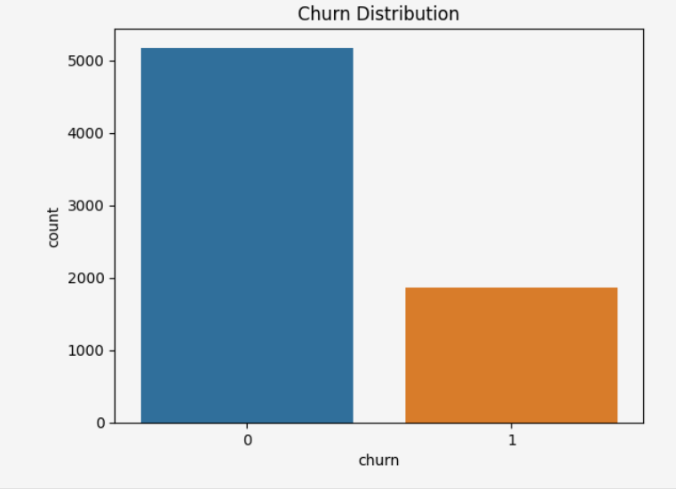
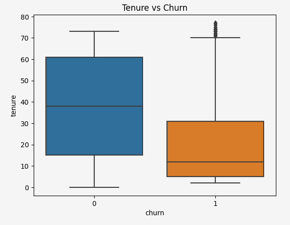
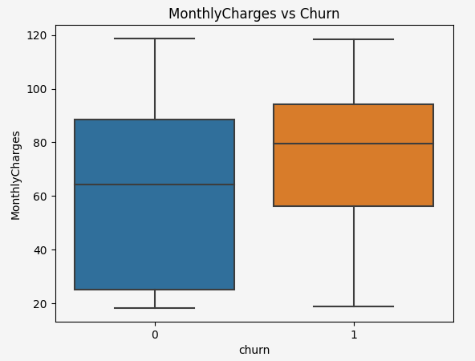

## 🚀 Case study Highlights

- 🎯 Goal: Predict customer churn  
- 🧠 Model: Gradient Boosting  
- 📊 Performance: AUC-ROC > 0.91  
- 💡 Impact: Supports customer retention strategies  

# Customer Churn Prediction — Interconnect

## Overview
This case study focuses on predicting customer churn for a telecom company (Interconnect). The goal is to identify customers who are likely to leave the service, enabling the business to take proactive retention actions.

---

## Business Problem
Customer churn directly impacts revenue and growth. Acquiring new customers is significantly more expensive than retaining existing ones.

The company needs a reliable way to:
- Identify customers at risk of leaving
- Take action before churn happens
- Improve customer lifetime value

---

## Objective
Develop a machine learning model capable of predicting whether a customer will churn based on their service usage, contract details, and billing information.

---

## Data Description
The dataset includes:
- Customer demographics
- Contract type and tenure
- Internet and phone services
- Monthly and total charges

---

## Methodology

### 1. Data Preparation
- Cleaned inconsistent data types
- Handled missing values
- Converted categorical variables into numerical format

### 2. Exploratory Data Analysis
- Identified key churn drivers (contract type, tenure, charges)
- Analyzed class imbalance

### 3. Feature Engineering
- Created meaningful features to improve model performance

### 4. Model Training
Tested multiple models:
- Logistic Regression (baseline)
- Random Forest
- Gradient Boosting

---

## Results

- ✅ **Best Model:** Gradient Boosting  
- 📊 **AUC-ROC:** > 0.91  
- 📈 Strong ability to distinguish between churn and non-churn customers  

---

## Business Impact

This model enables the company to:

- Identify high-risk customers early  
- Design targeted retention strategies  
- Reduce customer loss and increase revenue  

💡 Even a small reduction in churn can lead to significant financial gains.

---

## Tech Stack

- Python  
- Pandas, NumPy  
- Scikit-learn  
- Matplotlib, Seaborn  

---

## Key Takeaways

- Data quality and feature engineering had a major impact on performance  
- Tree-based models outperformed linear models  
- Model evaluation metrics (AUC-ROC) were critical for selection  

---

## 📊 Key Insights

### Churn Distribution

The dataset shows a class imbalance, with a smaller proportion of customers churning. This highlights the importance of using appropriate evaluation metrics such as AUC-ROC when evaluating model performance.

---

### Tenure vs Churn

Customers who churn tend to have significantly lower tenure compared to those who stay. This suggests that the highest risk of churn occurs during the early stages of the customer lifecycle, highlighting the importance of improving onboarding and early customer engagement strategies.

---

### Monthly Charges vs Churn

Customers who churn tend to show different monthly charge patterns, suggesting that pricing and perceived value may influence retention. This indicates that pricing strategy and service value communication can play an important role in reducing churn.
## Author

**Yezid Feria**  
Data Analyst | Data Science | Business Impact  
